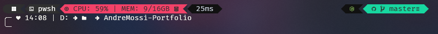

# Oh My Posh Minimal Night Theme

## Contents 📦

- Theme for Oh-My-Posh

## Dependencies 📃

- Oh-My-Posh
- Nerd Fonts >= 3.0

## Available Options ⚙️

- minimalNight.omp.json (Default)
- accent_minimalNight.omp.json (MacOS and Windows Only)
- alert_iminimalNight.omp.json
- term_minimalNight.omp.json

#### Default

Contains pre-determined colors

#### Accent

> [!WARNING]
> Only Works for Windows and MacOS

It focuses on obtaining the theme from your terminal and accent of the OS

#### Alert

Uses default colors but the blocks like Github and others come from the terminal theme

#### Term

Uses the theme of your terminal for all colors.
